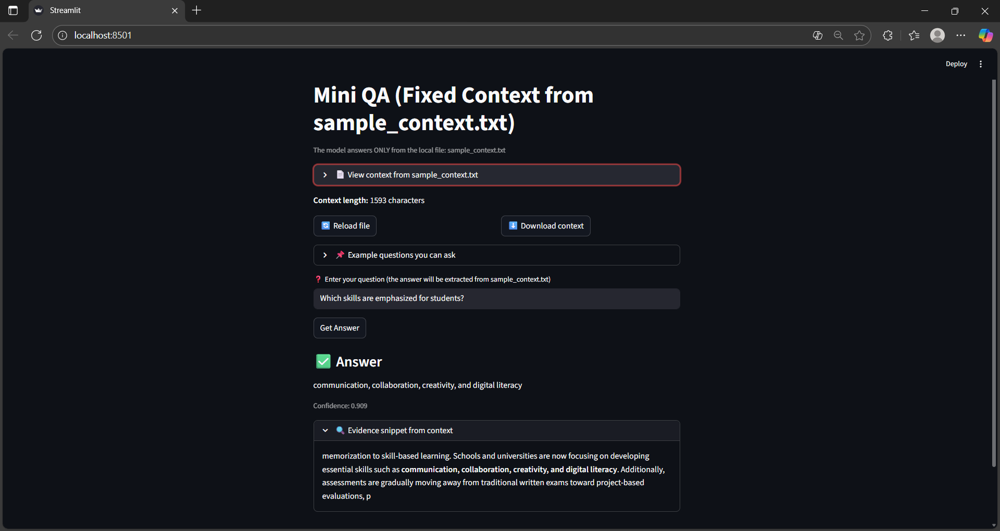

# 📘 Mini Question-Answering System

This project is a **mini Question-Answering (QA) system** built using a pretrained transformer model  
`distilbert-base-uncased-distilled-squad`.  
The model **does not train**, it only extracts answers from a fixed text file: `sample_context.txt`.

---

## ✅ Features
- Uses **HuggingFace Transformers**
- Works fully on **CPU** (no GPU required)
- Reads context **only from `sample_context.txt`**
- Web interface built with **Streamlit**
- Shows example questions for easy testing
- Confidence score displayed for every answer
- Optional evidence highlighting from paragraph

---

## UI Preview & Workflow
*Below is a preview of the application's UI and an illustration of the text cleaning workflow.*

